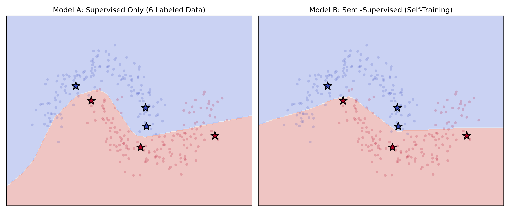
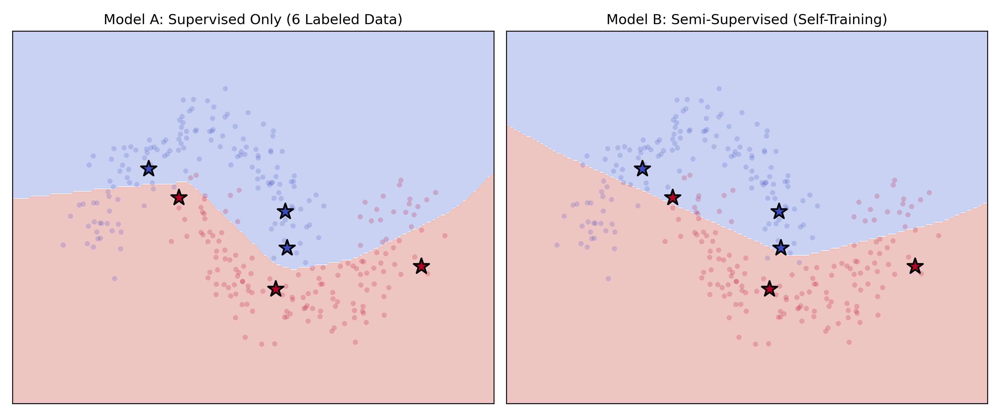
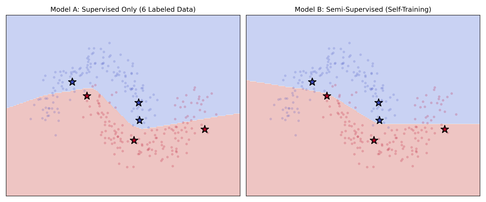
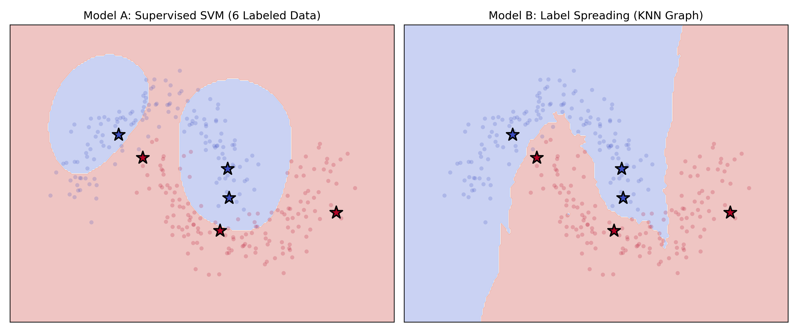
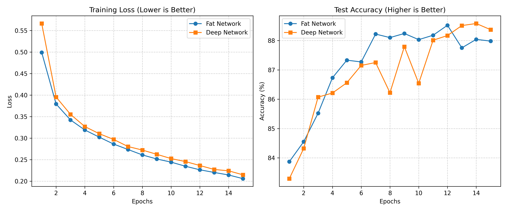

# 半監督式學習
將李宏毅老師機器學習課程（Lecture 12）中的理論具象化，透過程式碼對照實驗，驗證半監督式學習在標籤匱乏場景下的運作機制

### 實驗設計
* 資料集：用 scikit-learn Two Moons 雙半月形資料集，共 300 筆。
* 標籤匱乏情境：刻意僅 6 筆資料作為有Labeled data，其餘 294 筆Unlabeled data
* 實驗進程：分為兩階段進行。起初採用Self-Training，發現成效不理想，改用第二階段則引入Label Spreading修正與對照。

### 第一階段實驗失敗分析：
在實驗初期，我首先實作了直覺的 Self-Training。使用MLP 先在 6 筆資料上訓練，接著預測無標籤資料，試圖將高信心的預測結果加回訓練集中迭代。

* 意外結果：即便將偽標籤的Confidence Threshold由一開始的0.85嚴格拉高至 0.997(如附圖)，模型的決策邊界依然發生了嚴重的退化，完全破壞了雙半月的幾何分佈。
* 根本原因分析 (採信AI看法)：這段失敗的實作精準印證了神經網路在半監督學習中的兩大缺陷：
  1. Overconfidence：神經網路最後一層輸出的 Softmax 機率值無法代表真實的不確定性。即使模型猜錯，依然容易給出 > 0.99 的極高數值，導致嚴格的門檻形同虛設。
  2. 汙染放大與傳播：由於初始的 6 筆資料無法提供完美的初始邊界，模型在第一波迭代就選入了錯誤的偽標籤。隨後模型利用這些「被污染」的資料自我訓練，導致誤差被不斷放大（Poisoning the training set）。
  3. 缺乏流形感知：部分採信AI觀點:MLP 仰賴線性組合與梯度下降，天生缺乏順著資料拓樸形狀（流形）蔓延的 Inductive Bias。

然而我直覺上扔會認為課已用多個線性函數逼近流行應是我取的硬標籤數量過少，真實情況或許能緩解此問

(由上至下分別為Confidence_threshold取0.85/0.95/0.997)

### 第二階段引進 Label Spreading (下圖) 
基於第一階段的失敗教訓，引入 Smoothness Assumption在第二階段，我改採用老師在課堂上分享的標籤手拉手的方式進行改良

* A純監督式 SVM 對照組 左圖所示，僅用 6 筆資料的純監督式 SVM 只能保守地在已知點周圍劃出橢圓形的防護邊界，無法感知全局。
* B半監督式 Label Spreading如右圖所示，透過設定 n_neighbors=7 建構 KNN Graph，294 筆無標籤資料成功發揮了手拉手作用 標籤如同墨水般，順著高密度的半月形內部傳播，並在兩個半月形之間的低密度分野止步。決策邊界大致正確切開流行

---

# Why Deep?胖淺模型V.瘦深模型
理解到胖淺模型欠缺模組化/參數效率指數型遞減/偏向死背的的缺點實作兩個近似餐數量的模型來對比

### 實驗設計
* 資料集：採用AI推薦的 Fashion-MNIST 服飾影像資料集，相較於手寫數字，有更豐富的邊緣與紋理特徵，適合檢驗模型的特徵萃取能力。
* 實驗控制變因:總參數量
* 對照組Model A: Fat Network：
  架構：單一極寬的隱藏層（126 個神經元）。
  總參數量：經精算為 100,180。
* 實驗組 Model B: Deep Network：
  架構：4 層較窄的隱藏層（每層 93 個神經元）。
  總參數量：調配為 100,171。
  註：誤差僅 9 個。

### 實驗結果與視覺化分析
(如圖：Deep_vs_Fat_Result.png 訓練曲線圖) 

執行 15 個 Epoch 後，觀察到兩個極具指標性的現象：

* 胖淺的死背優勢 (Taining Loss 表現) 如圖左，Fat Network (藍線) 的 Training Loss 下降速度與幅度皆優於 Deep Network (橘線)。這印證了在擁有極寬隱藏層的情況下，模型能作為一個巨大的查找表，將訓練集看過的像素排列方式硬記下來
* 深層網路的泛化反超 如圖右所示，真正的實力差距展現在未知的測試集上。Fat Network (藍線) 在 Epoch 7-9 遇到效能天花板，並在 Epoch 12 之後出現明顯的Overfitting跡象，準確率下滑。反觀 Deep Network (橘線)，雖然前期學習較為震盪，但憑藉著階層式的特徵萃取，在 Epoch 14 成功突破藍線的天花板，展現出更穩定且優異的泛化能力。