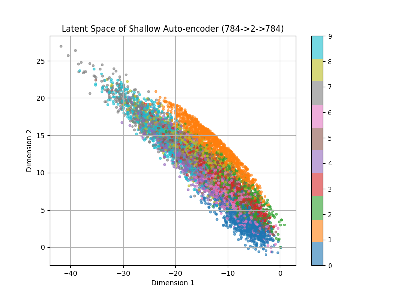
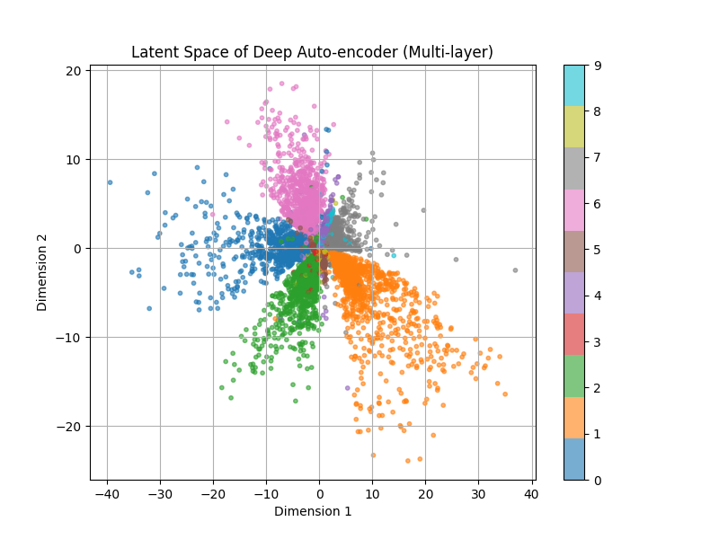
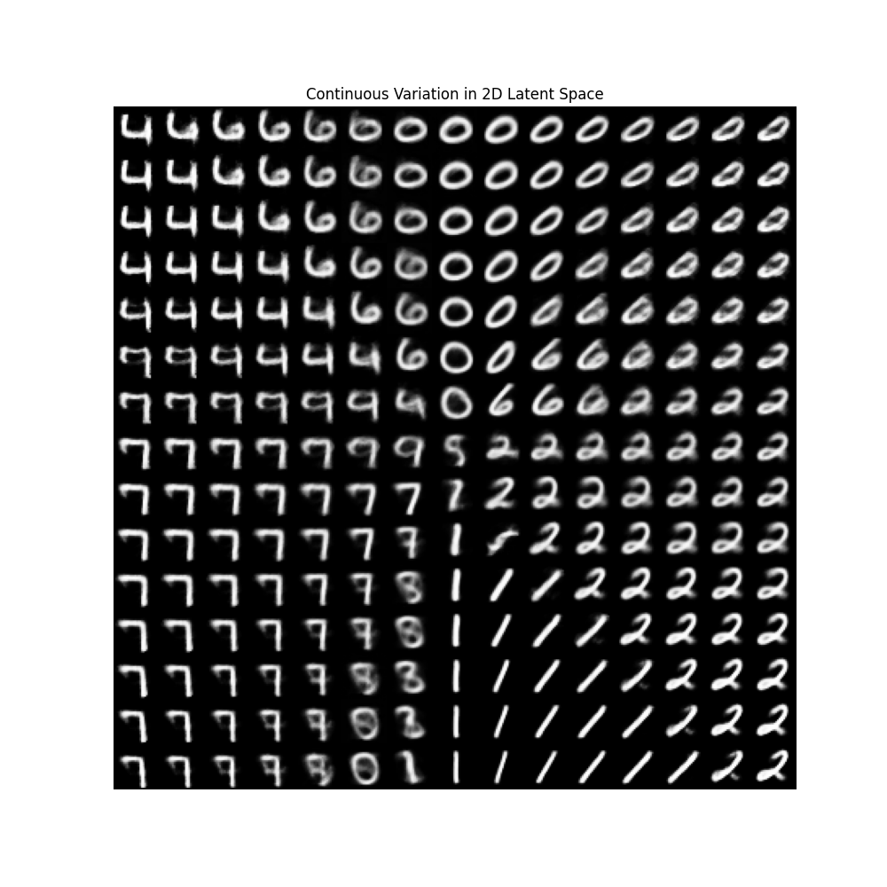
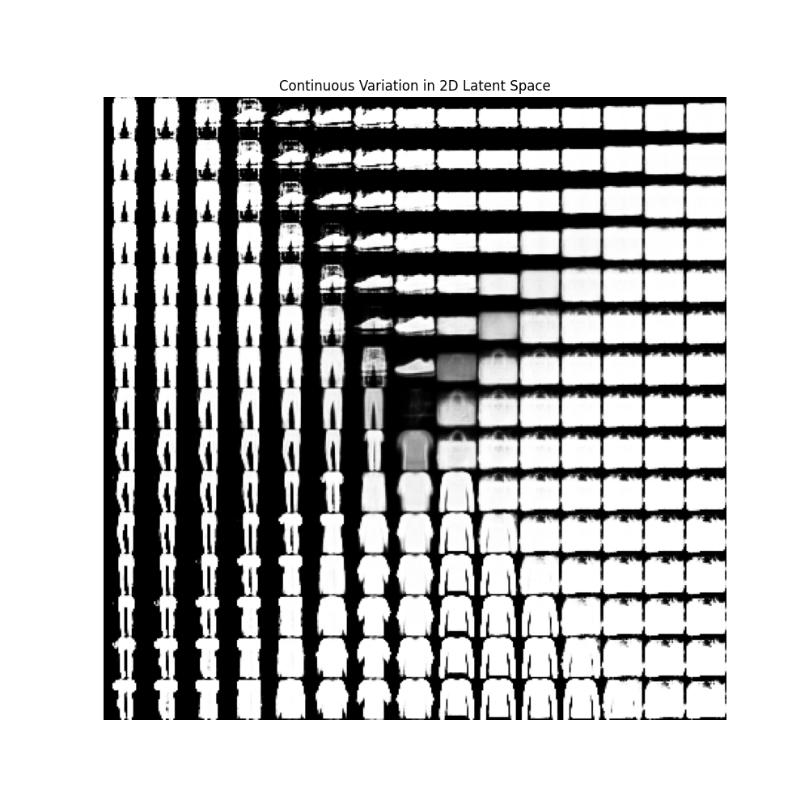
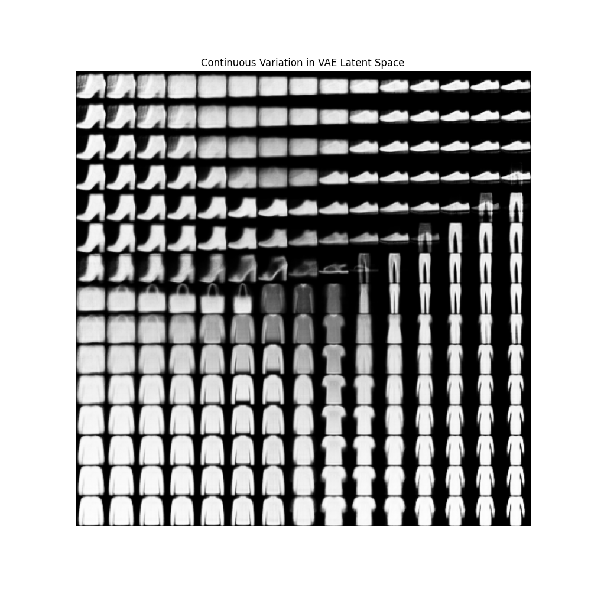

# Auto-encoder 與 VAE 之潛空間限制

## 報告重點摘要
基於課堂上分享的無監督學習架構，本次實作並比較了淺層與深層自動編碼器在特徵降維與重建任務上的差異。透過 MNIST 與 FashionMNIST 雙資料集的實驗，驗證了加入非線性破壞（ReLU）能成功跳脫 PCA 限制，賦予模型特徵分群的能力。

---

## 特徵較少資料集：MNIST 特徵降維與分群能力
本階段將 28x28 (784 維) 的手寫數字圖片壓縮至 2 維空間，並進行視覺化對比。

* **淺層模型**：實驗結果顯示，僅具備單層線性轉換的 PCA 架構，無法解開手寫數字高度糾纏的非線性特徵，導致潛在空間中的數字分類高度重疊，呈現缺乏鑑別度的帶狀分佈。
* **深層模型**：加入多層隱藏層與 ReLU 激活函數後，破壞了原有線性結構，使得網路具備更高的空間可塑性。視覺化結果顯示，相同的數字在二維空間中自動聚集成高密度的 Clusters，實現了無監督下的特徵分群。

上圖為淺層（等價 PCA），下圖為深層（經 ReLU 扭曲後更容易分成叢集）。

---

## 起初的困惑與誤解
本次實作範圍包含 VAE。在觀察到 Latent Space 本身已具有連續性，且了解此連續性質是源於神經網路本身的連續函數特性後，不禁產生疑問：若直接使用 AE 於潛在空間取樣，必然也能做到平滑過渡，那為何還需要特別發明 VAE 來解決連續性問題？VAE 的存在是否多此一舉？

Latent Space 在不使用 VAE 於簡單任務中就能看出連續性。

**反思的解答**：數學上的連續不等於語意上有意義的連續。AE 產生的僅是無意義的數值漸變，而 VAE 才能生成具備合理語意的延續（尤其在處理複雜的高維度空間時）。

---

## 特徵較多資料集：FashionMNIST 潛在空間連續性
為測試模型極限，選用特徵較複雜的衣物資料集 FashionMNIST，同樣於二維潛在空間中進行均勻網格取樣，並由 Decoder 生成影像。

**觀察結果與分析**：影像出現大量全白區塊，雖能勉強看出長褲至上衣的漸變趨勢，但過渡區域殘影與模糊嚴重，並伴隨破圖現象。

1.  **Bottleneck layer 太小**：將帶有紋理的 784 維服飾影像壓縮至僅剩 2 維潛空間，要保留顏色與邊緣輪廓實在強人所難。過多細節特徵遺失，解碼器僅能還原粗略的面積。
2.  **潛在空間的空白地帶**：標準自動編碼器缺乏對潛在空間分佈的標準化約束。在群集之間的「空白地帶」取樣時，解碼器接收到未知的特徵座標，導致神經元輸出異常數值，經最後一層 Sigmoid 函數飽和後，便產生了毫無漸層的純白或純黑區塊（此缺陷可透過 VAE 改善）。

上圖為維持原架構訓練之結果。

上圖為改良並使用 VAE 架構訓練之結果。